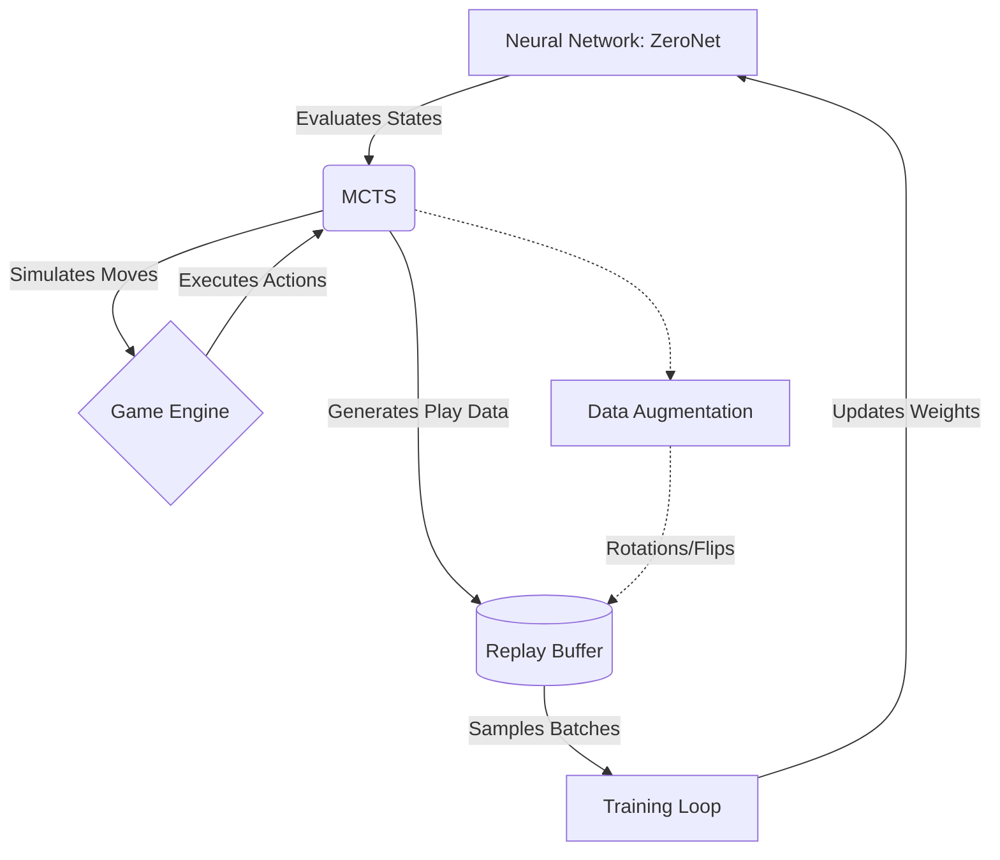

Activate the environment context (source .venv/bin/activate).

To play the game manually:

python main.py --mode play
To watch the untrained network attempt the game using raw MCTS rollouts:

python main.py --mode watch
To run the self-play training loop (saves to checkpoints/latest.pth automatically):

python main.py --mode train

# 2048-ai
### System Architecture Pipeline

---

### Codebase Summary (How It Works)

This codebase implements an AlphaZero-style reinforcement learning agent to master the game 2048. It leverages a custom convolutional residual neural network (`ZeroNet`) featuring two heads: a policy head that outputs a probability distribution over the four possible moves, and a value head that predicts the final board score.

Rather than acting on the network's raw output, the system uses Monte Carlo Tree Search (MCTS) to look ahead. MCTS relies on the neural network to evaluate leaf nodes, effectively balancing exploration (using Dirichlet noise) with exploitation (using the PUCT algorithm).

Training is driven by concurrent, batched self-play. Hundreds of games are simulated simultaneously on the GPU. As games finish, their states, MCTS-improved policies, and terminal values are passed through an 8-fold symmetry augmentation (rotations and reflections) and stored in a `ReplayBuffer`. The main training loop samples from this buffer to update the network weights via gradient descent. As the network becomes more accurate, the MCTS lookahead improves, creating a continuous loop of self-improvement. The project also includes a highly optimized 1D game engine for rapid simulation and a Pygame UI for human interaction and AI visualization.

---

### File and Function Explanations

#### `ai/mcts.py`

Monte Carlo Tree Search implementation for simulating future game states.

* **`Node`**: Data structure representing a single game state, tracking visit counts, accumulated value, and prior probabilities.
* **`MCTS.encode_state`**: Transforms the raw 2048 grid into a 16-channel one-hot tensor suitable for the neural network.
* **`MCTS.search_root` & `search_leaf**`: Traverses the tree from the root to an unexpanded leaf node based on the PUCT formula.
* **`MCTS.apply_dirichlet_noise`**: Adds noise to root action probabilities to encourage exploration during training.
* **`MCTS.backpropagate_leaf`**: Updates the value sums and visit counts for all nodes along the searched path.

#### `ai/model.py`

PyTorch neural network architecture.

* **`ResBlock`**: Standard residual block (Conv2d -> BatchNorm -> ReLU -> Conv2d -> Add -> ReLU) to prevent vanishing gradients in deep layers.
* **`ZeroNet`**: The main AlphaZero-style model. Takes the one-hot encoded board state and splits into two heads: `policy_logits` (direction probabilities) and `value` (scalar board evaluation).

#### `engine/game.py`

Optimized 2048 game logic.

* **`GameEngine.__init__`**: Initializes the game using a flat 1D Python list (`_flat_grid`) for maximum memory and iteration speed.
* **`GameEngine.move`**: Core sliding logic. Routes to `_shift_row` based on the specified direction (Up, Down, Left, Right).
* **`GameEngine._shift_row`**: Helper that compresses, merges, and recompresses a row. Uses `_ROW_CACHE` memoization to speed up repeating patterns.
* **`GameEngine.get_valid_moves`**: Unrolled, fast loop to check which of the 4 directions are legally playable.

#### `training/self_play.py`

Generates training data via batched AI self-play.

* **`play_games_concurrently`**: The core data generator. Runs `target_games` simultaneously on the GPU, orchestrating the MCTS searches and model batch-evaluations to avoid CPU bottlenecking.
* **`augment_data`**: Applies D4 symmetry (4 rotations, 2 reflections) to multiply the generated training data by 8x.
* **`evaluate_board`**: A heuristic function calculating a partial reward based on board monotonicity and empty tile count to help the network learn intermediate goals.

#### `training/replay_buffer.py`

* **`ReplayBuffer`**: A circular memory buffer that stores `(state, policy, value)` tuples from self-play and provides random batches via the `sample` method for neural network training.

#### `training/train.py`

* **`train`**: The primary execution loop. Orchestrates self-play, populates the replay buffer, and runs gradient descent on the `ZeroNet` model using Cross-Entropy (policy) and Mean Squared Error (value). Handles model checkpointing.

#### `ui/game_ui.py`

Visual interface using Pygame.

* **`GameUI.draw`**: Renders the 2048 grid, handling dynamic colors and text scaling for different tile values.
* **`GameUI.play_human`**: Event loop capturing arrow keys for manual play.
* **`GameUI.play_ai`**: Event loop that queries the trained MCTS model to automatically execute and visualize moves on the screen.

#### `main.py`

* **`main`**: CLI entry point. Parses arguments to launch the application in either `train`, `play` (human), or `watch` (AI) mode.

#### `engine/test_game.py` & `test_batch.py`

* **`test_game.py`**: Pytest unit tests validating the core rules of 2048 (merging, valid moves, game over states).
* **`test_batch.py`**: A small debug script to verify GPU concurrency and neural net compilation before launching a full training run.

